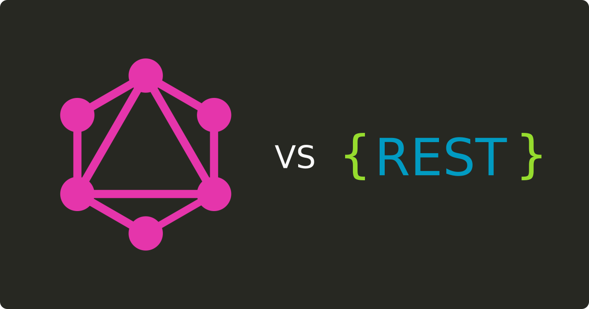
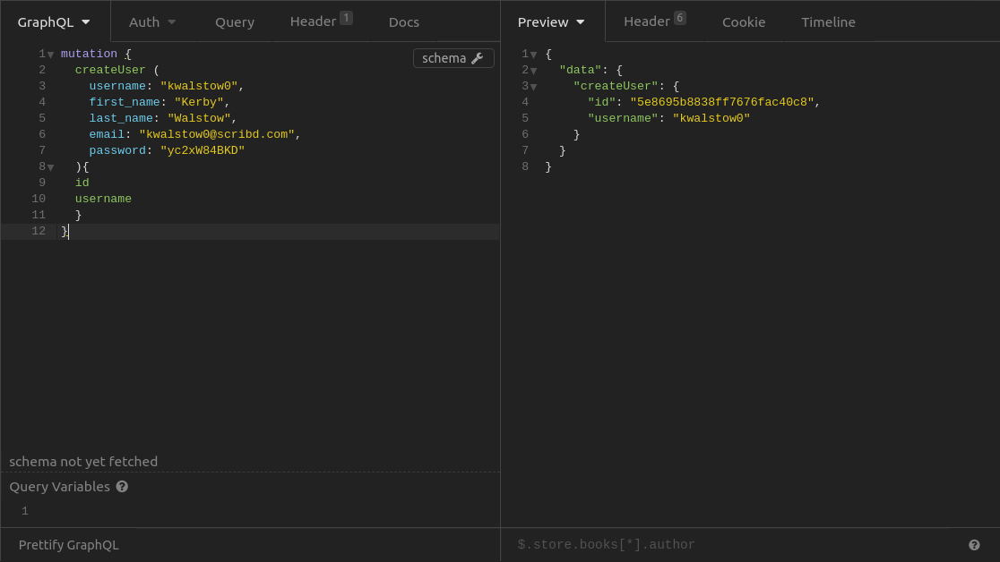
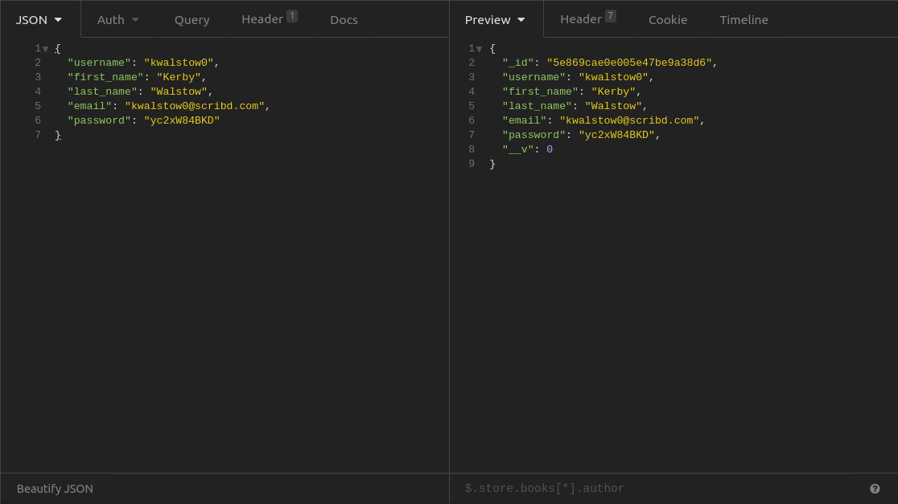
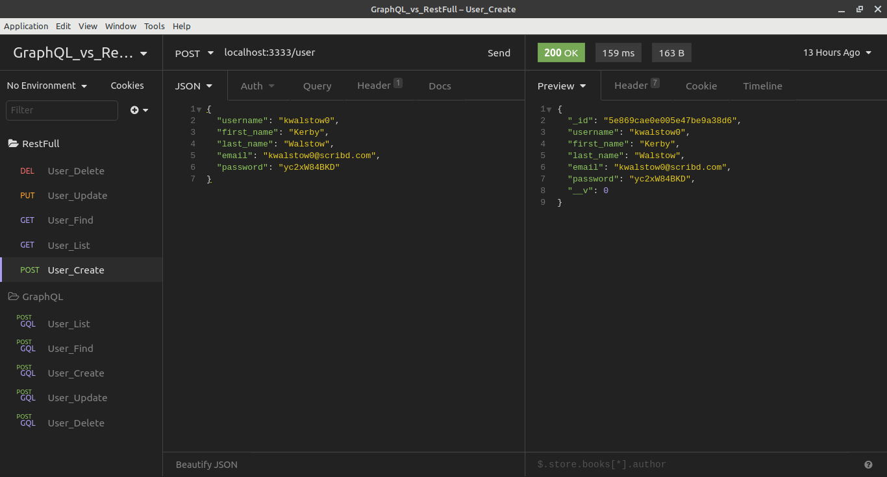

<h1 align="center">GraphQL vs RestFull</h1>
<p align="center">Node.js <strong>API</strong> em GraphQL e Rest</p>

<p align="center">
  <a aria-label="Versão do Node" href="https://github.com/nodejs/node/blob/master/doc/changelogs/CHANGELOG_V12.md#12.16.1">
    </img>
  </a>
</p>

## Instalação 
Para instalar as dependências e executar o **Servidor** (em modo desenvolvimento), clone o projeto em seu computador e em seguida execute:
```bash
cd graphql && yarn install
cd ..
cd rest && yarn install
```
De volta a pasta raiz execute:
```bash
cp .env.example .env
```
Em seguida altere as duas linhas do arquivo .env criado
```bash
vim .env
```


Para iniciar a api **GraphQL** utilize os comandos:
```bash
cd graphql
yarn dev
```

Para iniciar a api **Rest** utilize os comandos:
```bash
cd rest
yarn dev
```

## GraphQL



## RestFull


## Insomnia 
Para testar a API considere baixar e intalar o [Insomnia](https://insomnia.rest/download/) e em seguida clique na Workspace → `Import/Export` →  
`Import Data` → `From File` → e selecione o arquivo `insomnia.json` deste repositório. Assim que terminar, o resultado ficará assim:

</img>

[](https://insomnia.rest/run/?label=GraphQL_vs_RestFull&uri=https%3A%2F%2Fraw.githubusercontent.com%2Frhuanos%2FGraphQL_vs_Rest%2Fmaster%2Finsomnia.json)